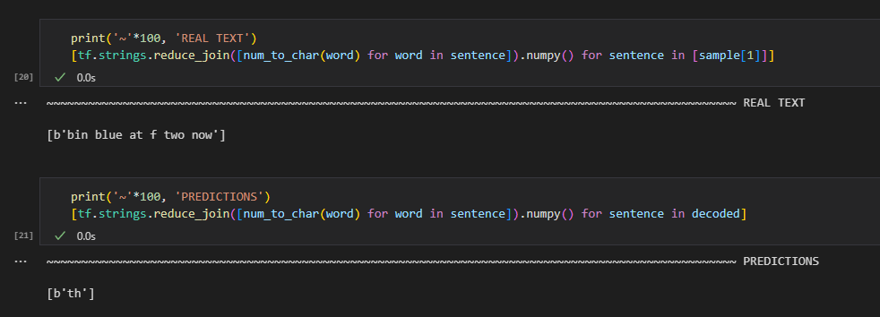
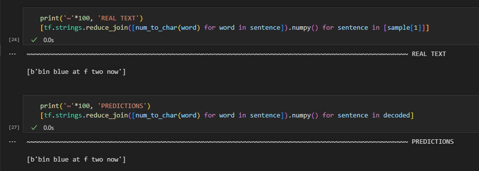

# **Lip Reading**

Subtask `Lip Reading` for KI-Projekt topic 2: `OFFLINE SPEECH ASSISTANT FOR TEST DRIVERS`. \
\
Main file: [LipNet.ipynb](LipNet.ipynb)

## **Group Members**

- Jimmy Tan (Group Expert)
- Wen Bin Bu
- Mikhail Ayzinov

## **Requirements**

- Python 3.8.10
- In [LipNet.ipynb](LipNet.ipynb), !pip install opencv-python==4.7.0.72 matplotlib==3.7.1 imageio==2.28.1 gdown==4.7.1 tensorflow==2.10.1

## **Credit**

- The implementation of LipNet used in this project is based on the work by [Nicholas Renotte](https://github.com/nicknochnack).
- You can find the LipNet implementation on [Github](https://github.com/nicknochnack/LipNet) and refer to the [corresponding Youtube tutorial](https://www.youtube.com/watch?v=uKyojQjbx4c&ab_channel=NicholasRenotte).

## **Data**

- The GRID audiovisual sentence corpus [https://spandh.dcs.shef.ac.uk//gridcorpus/](https://spandh.dcs.shef.ac.uk//gridcorpus/)
  - GRID is a large multitalker audiovisual sentence corpus to support joint computational-behavioral studies in speech perception. In brief, the corpus consists of high-quality audio and video (facial) recordings of 1000 sentences spoken by each of 34 talkers (18 male, 16 female). Sentences are of the form "put red at G9 now". The corpus, together with transcriptions, is freely available for research use. GRID is described in more detail in this [paper](GRID_paper.pdf).
- Dataset is not included in this repository.

## **Pretrained Model**

- For inferencing, we utilize weights from a checkpoint (95/100) contributed by [Nicholas Renotte](https://github.com/nicknochnack).
- The model has been trained with data from a single talker out of a total of 34 in the dataset.

## **Result**

- Before model is trained

  

- After model is trained (using the pretrained model)

  

## **Contribution Guidelines**

1.  Clone this project [Link to Repo](https://mygit.th-deg.de/ki-project-b-plus/lip-reading)

        git clone https://mygit.th-deg.de/ki-project-b-plus/lip-reading.git

2.  Branch from Dev and name it as usual according to `contribution-guidelines.md/pdf` by Daniel Stoffel.
3.  Install `pre-commit` using the following command in the terminal:

        pip install pre-commit

4.  After it is installed, run the following command in the terminal:

        pre-commit install

5.  The formatter will be triggered everytime a git commit is initiated. If it passes the formatting test, the code will be commited. If not, the code commit will fail, and your code will be formatted to the desired format. You will then need to commit as usual again, and the test should now pass and your code should be committed.

## **Status**

The initial framework of the project has been completed. A meeting is scheduled for Monday, May 22nd, to discuss and determine whether to proceed with this project. \
Refer `ToDo` section to continue work on the project.

## **ToDo**

- Look for Dataset

## **Useful Links**

- [Link to Jira](https://jira-stud.th-deg.de/projects/OFA/summary)
- [Link to Repo](https://mygit.th-deg.de/ki-project-b-plus/lip-reading)
